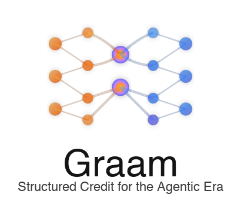
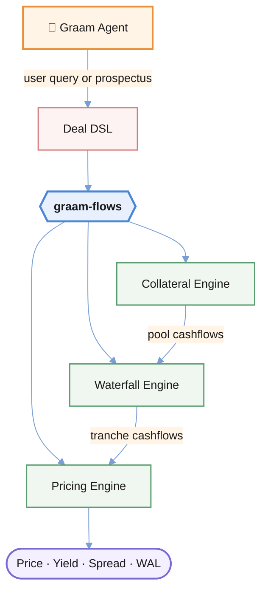

<p align="center">
  
</p>

graam-flows is the open execution layer behind [Graam](https://graam.ai).

It provides a deterministic, auditable engine for running structured credit deals — from collateral projections through waterfall execution to bond analytics.

The goal is to move structured credit away from encrypted CDI files and fragmented spreadsheet models toward a shared, executable representation of a deal.

## Why this exists

Structured credit workflows today rely heavily on spreadsheets and fragmented models. Deals are often re-built independently by each party, introducing inconsistencies and operational risk.

graam-flows provides a single, executable representation of a deal that can be:
- run consistently across parties
- validated deterministically
- reused without re-building

This is a step toward making structured credit programmable.

## Relationship to Graam

graam-flows is the execution layer. [Graam](https://graam.ai) builds on top of it with:
- AI-driven deal structuring
- document parsing and generation
- end-to-end workflows for issuers and investors

This repository focuses on the deterministic modeling layer.

## How it works



## What it does

graam-flows has three engines:

1. **Collateral engine** - projects loan pool cashflows from asset-level data and assumptions (CPR, CDR, severity, delinquency). Supports fixed-rate, ARM, step-rate, and interest-only loans with ABS and CPR prepayment conventions.
2. **Waterfall engine** - distributes collateral cashflows across tranches according to deal rules. Produces period-by-period interest, principal, writedowns, and balance for each tranche.
3. **Pricing engine** - computes bond analytics from cashflow streams: price, yield, spread (Z-spread and discount margin), modified duration, WAL, and accrued interest. Supports arbitrary term structures and day count conventions.

The engines can be used together or independently. Generate collateral projections, run them through a waterfall, then price the output tranches — or use any engine in isolation.

The engine supports the deal structures found in Auto ABS, RMBS, and credit risk transfer (CRT) securitizations: sequential and pro-rata payment priorities, shifting interest, enhancement caps, trigger-dependent structure switching, reserve accounts, OC turbo mechanisms, and more.

## Quick start

### Prerequisites

- [.NET 10 SDK](https://dotnet.microsoft.com/download)

### Build and test

```sh
dotnet build
dotnet test
```

### Run the API

```sh
dotnet run --project src/GraamFlows.Api
```

The API starts on `http://localhost:5200` with Swagger UI at `/swagger`.

### Docker

```sh
docker build -t graam-flows .
docker run -p 5200:5200 graam-flows
```

### Run the CLI

```sh
dotnet run --project src/GraamFlows.Cli -- run --deal path/to/deal.json
```

## API usage

### Collateral projection

`POST /api/calccollateral` projects loan pool cashflows from asset data and assumptions.

```json
{
  "projectionDate": "2024-01-25",
  "assets": [
    {
      "assetName": "Pool",
      "interestRateType": "FRM",
      "originalDate": "2023-06-01",
      "originalBalance": 100000000,
      "originalInterestRate": 6.5,
      "currentInterestRate": 6.5,
      "originalAmortizationTerm": 72,
      "currentBalance": 95000000,
      "serviceFee": 1.0
    }
  ],
  "assumptions": {
    "cpr": 6.0,
    "cdr": 1.0,
    "severity": 40.0,
    "prepaymentType": "CPR"
  }
}
```

Assumptions support constant scalars, per-period vectors (`cprVector: [6.0, 7.0, 8.0, ...]`), or ramp strings (`cprVectorStr: "1.0R12,6.0"`). Prepayment convention can be `CPR` (% of current balance, standard for RMBS) or `ABS` (% of original balance, standard for Auto ABS).

### Pricing and analytics

`POST /api/pricing` computes bond analytics from a cashflow stream.

```json
{
  "cashflows": [
    { "date": "2024-02-25", "interest": 333333, "principal": 1500000, "balance": 98500000 },
    { "date": "2024-03-25", "interest": 328333, "principal": 1500000, "balance": 97000000 }
  ],
  "params": {
    "inputType": "price",
    "inputValue": 99.5,
    "settleDate": "2024-01-25",
    "balance": 100000000,
    "dayCount": "30/360",
    "compounding": "SemiAnnual"
  },
  "rates": [[0.5, 5.0], [1.0, 4.8], [2.0, 4.6], [5.0, 4.5], [10.0, 4.4]]
}
```

Input types: `price` (solve for yield/spread), `yield` (solve for price), `spread` (solve for price from Z-spread). Returns price, yield, Z-spread, discount margin, modified duration, WAL, and accrued interest. The `rates` array provides a term structure as `[term_years, rate_percent]` pairs for spread and duration calculations.

### Waterfall execution

`POST /api/waterfall` distributes collateral cashflows across tranches and returns tranche-level cashflows.

```json
{
  "projectionDate": "2024-01-25",
  "collateralCashflows": [
    {
      "cashflowDate": "2024-02-25",
      "beginBalance": 100000000,
      "scheduledPrincipal": 1000000,
      "unscheduledPrincipal": 500000,
      "interest": 666667,
      "defaultedPrincipal": 0,
      "recoveryPrincipal": 0
    }
  ],
  "deal": {
    "dealName": "EXAMPLE-2024-1",
    "waterfallType": "ComposableStructure",
    "interestTreatment": "Collateral",
    "tranches": [
      {
        "trancheName": "A",
        "originalBalance": 80000000,
        "couponType": "Fixed",
        "fixedCoupon": 5.0,
        "firstPayDate": "2024-02-25",
        "dayCount": "30/360",
        "cashflowType": "PI",
        "trancheType": "Offered"
      },
      {
        "trancheName": "B",
        "originalBalance": 20000000,
        "couponType": "Fixed",
        "fixedCoupon": 6.0,
        "firstPayDate": "2024-02-25",
        "dayCount": "30/360",
        "cashflowType": "PI",
        "trancheType": "Offered"
      }
    ],
    "unifiedWaterfall": {
      "executionOrder": [
        "INTEREST",
        "PRINCIPAL_SCHEDULED",
        "PRINCIPAL_UNSCHEDULED",
        "WRITEDOWN"
      ],
      "steps": [
        {
          "type": "INTEREST",
          "structure": { "type": "SEQ", "tranches": ["A", "B"] }
        },
        {
          "type": "PRINCIPAL",
          "source": "scheduled",
          "default": { "type": "SEQ", "tranches": ["A", "B"] }
        },
        {
          "type": "PRINCIPAL",
          "source": "unscheduled",
          "default": { "type": "SEQ", "tranches": ["A", "B"] }
        },
        {
          "type": "WRITEDOWN",
          "structure": { "type": "SEQ", "tranches": ["B", "A"] }
        }
      ]
    }
  }
}
```

The API accepts both `camelCase` and `snake_case` JSON keys.

## Deal definition

Deals can be defined using the **unified waterfall** format (recommended) or the lower-level **PayRules DSL**.

### Unified waterfall

The unified waterfall is a steps-based format where each step defines how a specific cashflow type is distributed. Step types:

| Step | Description |
|---|---|
| `INTEREST` | Interest distribution to tranches |
| `PRINCIPAL` | Principal distribution (source: `scheduled`, `unscheduled`, `recovery`) |
| `WRITEDOWN` | Loss allocation (reverse seniority) |
| `EXPENSE` | Deal expense payments |
| `RESERVE_DEPOSIT` | Reserve account deposits |
| `EXCESS_TURBO` | OC turbo paydown from excess interest |
| `EXCESS_RELEASE` | Remaining excess to certificateholders |
| `SUPPLEMENTAL_REDUCTION` | Credit-support-capped subordinate reduction |
| `CAP_CARRYOVER` | WAC cap shortfall payback |

### Payable structures

Each step uses a payable structure tree to define distribution order:

| Structure | DSL | Description |
|---|---|---|
| Sequential | `SEQ(A, B, C)` | Pay A fully, then B, then C |
| Pro rata | `PRORATA(A, B)` | Split proportionally by balance |
| Shifting interest | `SHIFTI(0.7, seniors, subs)` | Split by percentage (70/30) |
| Enhancement cap | `CSCAP(0.055, seniors, subs)` | Redirect excess credit support to subs |
| Fixed amount | `FIXED(var, primary, overflow)` | Fixed dollar amount to primary, rest to overflow |
| Forced paydown | `FORCE_PAYDOWN(forced, support)` | Force one tranche to zero first |
| Proforma | `PROFORMA(A, 0.6, B, 0.4)` | Fixed percentage shares |

Structures can be nested: `SEQ(PRORATA('A-1','A-2','A-3'), SINGLE('B'), SINGLE('C'))`.

### Trigger-dependent structures

Principal structures can switch based on trigger pass/fail state:

```json
{
  "type": "PRINCIPAL",
  "source": "scheduled",
  "rules": [
    {
      "when": { "pass": ["CE_Test"] },
      "structure": { "type": "SHIFTI", "shiftVariable": "ShiftPct", ... }
    },
    {
      "structure": { "type": "SEQ", "tranches": ["A", "B", "C"] }
    }
  ]
}
```

Rules are evaluated in order; the first match wins. A rule with no `when` is the unconditional fallback.

### Execution order

The `executionOrder` array controls which steps run and in what sequence. The default order is:

```
EXPENSE -> INTEREST -> PRINCIPAL_SCHEDULED -> PRINCIPAL_UNSCHEDULED ->
PRINCIPAL_RECOVERY -> RESERVE -> WRITEDOWN -> EXCESS_TURBO -> EXCESS_RELEASE
```

### Interleaved waterfall ordering

The `waterfallOrder` field controls how interest and principal interact:

- `standard` (default): all interest paid, then all principal
- `interestFirst`: per seniority level, pay interest then principal
- `principalFirst`: per seniority level, pay principal then interest

## Project structure

```
src/
  GraamFlows.Api/          REST API (ASP.NET Core)
  GraamFlows.Cli/          Command-line interface
  GraamFlows.Core/         Waterfall engine, rules engine, triggers
  GraamFlows.Domain/       Domain models (Deal, Tranche, PayRule, etc.)
  GraamFlows.Objects/      Interfaces, enums, data contracts
  GraamFlows.Util/         Pricing analytics, calendar, day counters, term structure, solvers
tests/
  GraamFlows.Tests/        Unit and integration tests (xUnit)
```

### Core components

- **Amortizer** (`Core/AssetCashflowEngine/Amortizer.cs`) - High-performance collateral cashflow generator using parallel array processing. Projects scheduled principal, prepayments, defaults, recoveries, and delinquencies for fixed-rate, ARM, step-rate, and IO loans.
- **ComposableStructure** (`Core/Waterfall/Structures/ComposableStructure.cs`) - The waterfall execution engine. Runs step-based waterfall periods, tracking available funds through each step.
- **Payable structures** (`Core/Waterfall/Structures/PayableStructures/`) - Composable payment distribution trees (Sequential, Prorata, ShiftingInterest, EnhancementCap, etc.).
- **RulesEngine** (`Core/RulesEngine/`) - Compiles PayRule DSL formulas into executable C# at runtime using Roslyn. Supports trigger conditions, variable lookups, balance queries, and structure-building functions.
- **UnifiedWaterfallBuilder** (`Api/Transformers/UnifiedWaterfallBuilder.cs`) - Transforms the steps-based JSON format into PayRule DSL for the engine.
- **Cashflow** (`Util/Finance/Cashflow.cs`) - Bond analytics calculator. Computes price, yield, Z-spread, discount margin, modified duration, WAL, and accrued interest from any cashflow stream against a term structure.
- **Solvers** (`Util/Solvers1D/`) - Numerical root-finding (Brent, Newton-Raphson, bisection, etc.) used by the pricing engine to solve for yield and spread.

## Supported deal types

The engine has been used to model:

- **Auto ABS** - sequential/turbo structures with OC targets (e.g., Exeter, Ford, Ally)
- **Private-label RMBS** - shifting interest with WAC caps and trigger-dependent structures (e.g., COLT, Angel Oak)
- **Credit risk transfer (CRT)** - guaranteed interest, supplemental reduction, computed variables (e.g., STACR)

## License

See [LICENSE](LICENSE) for details.
