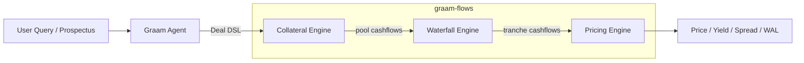

<p align="center">
  
</p>

graam-flows is the open execution layer behind [Graam](https://graam.ai).

It provides a deterministic, auditable engine for running structured credit deals — from collateral projections through waterfall execution to bond analytics.

The goal is to move structured credit away from encrypted CDI files and fragmented spreadsheet models toward a shared, executable representation of a deal.

Read more: [From CDI Files to Executable Deals](https://medium.com/@shariff.elkordy/from-cdi-files-to-executable-deals-open-sourcing-the-execution-layer-of-structured-credit-and-abf-ba17a56ee27c)

## Why this exists

Structured credit workflows today rely heavily on spreadsheets and fragmented models. Deals are often re-built independently by each party, introducing inconsistencies and operational risk.

graam-flows provides a single, executable representation of a deal that can be:
- run consistently across parties
- validated deterministically
- reused without re-building

This is a step toward making structured credit programmable.

## Relationship to Graam

graam-flows is the execution layer. [Graam](https://graam.ai) builds on top of it with:
- AI-driven deal structuring
- document parsing and generation
- end-to-end workflows for issuers and investors

This repository focuses on the deterministic modeling layer.

## How it works


```mermaid
graph LR
    Input["User Query / Prospectus"] --> Agent["Graam Agent"]
    Agent -->|Deal DSL| D
    subgraph graam-flows
        D["Collateral Engine"] -->|pool cashflows| E["Waterfall Engine"]
        E -->|tranche cashflows| F["Pricing Engine"]
    end
    F --> Output["Price / Yield / Spread / WAL"]
```

## What it does

graam-flows has three engines:

1. **Collateral engine** - projects loan pool cashflows from asset-level data and assumptions (CPR, CDR, severity, delinquency). Supports fixed-rate, ARM, step-rate, and interest-only loans with ABS and CPR prepayment conventions.
2. **Waterfall engine** - distributes collateral cashflows across tranches according to deal rules. Produces period-by-period interest, principal, writedowns, and balance for each tranche.
3. **Pricing engine** - computes bond analytics from cashflow streams: price, yield, spread (Z-spread and discount margin), modified duration, WAL, and accrued interest. Supports arbitrary term structures and day count conventions.

The engines can be used together or independently. Generate collateral projections, run them through a waterfall, then price the output tranches — or use any engine in isolation.

The engine supports the deal structures found in Auto ABS, RMBS, and credit risk transfer (CRT) securitizations: sequential and pro-rata payment priorities, shifting interest, enhancement caps, trigger-dependent structure switching, reserve accounts, OC turbo mechanisms, and more.

## Quick start

### Prerequisites

- [.NET 10 SDK](https://dotnet.microsoft.com/download)

### Build and test

```sh
dotnet build
dotnet test
```

### Run the API

```sh
dotnet run --project src/GraamFlows.Api
```

The API starts on `http://localhost:5200` with Swagger UI at `/swagger`.

### Docker

```sh
docker build -t graam-flows .
docker run -p 5200:5200 graam-flows
```

### Run the CLI

Both commands take the deal model as a positional argument:

```sh
# project a deal and export the cashflows to Excel
dotnet run --project src/GraamFlows.Cli -- run path/to/deal.json

# validate the deal's WAL against its published decrement table
dotnet run --project src/GraamFlows.Cli -- wal-tests path/to/deal.json --verbose
```

`wal-tests` strikes the grid entirely from the deal model — nothing is taken from the clock, so
two runs of the same file on different days give the same answer. Three fields decide the basis:

| Field | Meaning |
|---|---|
| `firstPaymentDate` (deal level) | First distribution date, when the tranches carry only a `payDay`. Per-tranche `firstPayDate` wins; `closingDate` is the last resort. A deal that states none of the three is rejected rather than anchored to today. |
| `walScenarios.assumptions.prepaymentType` | `CPR` (% of current balance — the default, and what RMBS decrement tables are struck in) or `ABS` (% of original balance, the auto-ABS convention). |
| `walScenarios.assumptions.callTriggers` | Names of the triggers the "to redemption date" column is struck to; the run stops at whichever fires first. Omitted, a dated `DATE_TERMINATION` redemption is used when the deal declares one, else the `COLLATERAL_VALUE` clean-up. |

## API usage

### Collateral projection

`POST /api/calccollateral` projects loan pool cashflows from asset data and assumptions.

```json
{
  "projectionDate": "2024-01-25",
  "assets": [
    {
      "assetName": "Pool",
      "interestRateType": "FRM",
      "originalDate": "2023-06-01",
      "originalBalance": 100000000,
      "originalInterestRate": 6.5,
      "currentInterestRate": 6.5,
      "originalAmortizationTerm": 72,
      "currentBalance": 95000000,
      "serviceFee": 1.0
    }
  ],
  "assumptions": {
    "cpr": 6.0,
    "cdr": 1.0,
    "severity": 40.0,
    "prepaymentType": "CPR"
  }
}
```

Assumptions support constant scalars, per-period vectors (`cprVector: [6.0, 7.0, 8.0, ...]`), or ramp strings (`cprVectorStr: "1.0R12,6.0"`). Prepayment convention can be `CPR` (% of current balance, standard for RMBS) or `ABS` (% of original balance, standard for Auto ABS).

### Pricing and analytics

`POST /api/pricing` computes bond analytics from a cashflow stream.

```json
{
  "cashflows": [
    { "date": "2024-02-25", "interest": 333333, "principal": 1500000, "balance": 98500000 },
    { "date": "2024-03-25", "interest": 328333, "principal": 1500000, "balance": 97000000 }
  ],
  "params": {
    "inputType": "price",
    "inputValue": 99.5,
    "settleDate": "2024-01-25",
    "balance": 100000000,
    "dayCount": "30/360",
    "compounding": "SemiAnnual"
  },
  "rates": [[0.5, 5.0], [1.0, 4.8], [2.0, 4.6], [5.0, 4.5], [10.0, 4.4]]
}
```

Input types: `price` (solve for yield/spread), `yield` (solve for price), `spread` (solve for price from Z-spread). Returns price, yield, Z-spread, discount margin, modified duration, WAL, and accrued interest. The `rates` array provides a term structure as `[term_years, rate_percent]` pairs for spread and duration calculations.

### Waterfall execution

`POST /api/waterfall` distributes collateral cashflows across tranches and returns tranche-level cashflows.

```json
{
  "projectionDate": "2024-01-25",
  "collateralCashflows": [
    {
      "cashflowDate": "2024-02-25",
      "groupNum": "1",
      "beginBalance": 100000000,
      "scheduledPrincipal": 1000000,
      "unscheduledPrincipal": 500000,
      "interest": 666667,
      "netInterest": 585417,
      "serviceFee": 81250,
      "defaultedPrincipal": 0,
      "recoveryPrincipal": 0
    }
  ],
  "deal": {
    "dealName": "EXAMPLE-2024-1",
    "waterfallType": "ComposableStructure",
    "interestTreatment": "Collateral",
    "closingDate": "2024-01-25",
    "tranches": [
      {
        "trancheName": "A",
        "originalBalance": 80000000,
        "couponType": "Fixed",
        "fixedCoupon": 5.0,
        "firstPayDate": "2024-02-25",
        "legalMaturityDate": "2030-01-25",
        "dayCount": "30/360",
        "cashflowType": "PI",
        "trancheType": "Offered",
        "payDay": 25,
        "payFrequency": 12
      },
      {
        "trancheName": "B",
        "originalBalance": 20000000,
        "couponType": "Fixed",
        "fixedCoupon": 6.0,
        "firstPayDate": "2024-02-25",
        "legalMaturityDate": "2030-01-25",
        "dayCount": "30/360",
        "cashflowType": "PI",
        "trancheType": "Offered",
        "payDay": 25,
        "payFrequency": 12
      }
    ],
    "unifiedWaterfall": {
      "executionOrder": [
        "INTEREST",
        "PRINCIPAL_SCHEDULED",
        "PRINCIPAL_UNSCHEDULED",
        "WRITEDOWN"
      ],
      "steps": [
        {
          "type": "INTEREST",
          "structure": { "type": "SEQ", "tranches": ["A", "B"] }
        },
        {
          "type": "PRINCIPAL",
          "source": "scheduled",
          "default": { "type": "SEQ", "tranches": ["A", "B"] }
        },
        {
          "type": "PRINCIPAL",
          "source": "unscheduled",
          "default": { "type": "SEQ", "tranches": ["A", "B"] }
        },
        {
          "type": "WRITEDOWN",
          "structure": { "type": "SEQ", "tranches": ["B", "A"] }
        }
      ]
    }
  }
}
```

Required fields to note:

- **`collateralCashflows[].groupNum`** must match the group emitted by the unified waterfall (`"1"` by default). The default on `PeriodCashflowDto` is `"0"`, which will cause every PayRule to be skipped.
- **`collateralCashflows[].netInterest`** drives tranche interest distribution; `interest` alone is not used. When chaining from `/api/calccollateral`, both fields are populated automatically.
- **`deal.closingDate`** seeds `FirstSettleDate` on each tranche and anchors first-period accrual. Without it, accrual days collapse to zero for `interestTreatment: "Collateral"`.
- **`tranche.payFrequency`** is **payments per year** (12 = monthly, 4 = quarterly, 2 = semi-annual, 1 = annual), not months between payments. It must match the cadence of `collateralCashflows`; `/api/calccollateral` emits monthly cashflows, so tranches should use `12`. The default is `12`.

The API accepts both `camelCase` and `snake_case` JSON keys.

## Deal definition

Deals can be defined using the **unified waterfall** format (recommended) or the lower-level **PayRules DSL**.

### Unified waterfall

The unified waterfall is a steps-based format where each step defines how a specific cashflow type is distributed. Step types:

| Step | Description |
|---|---|
| `INTEREST` | Interest distribution to tranches |
| `PRINCIPAL` | Principal distribution (source: `scheduled`, `unscheduled`, `recovery`) |
| `WRITEDOWN` | Loss allocation (reverse seniority) |
| `EXPENSE` | Deal expense payments |
| `RESERVE_DEPOSIT` | Reserve account deposits |
| `EXCESS_TURBO` | OC turbo paydown from excess interest |
| `EXCESS_RELEASE` | Remaining excess to certificateholders |
| `SUPPLEMENTAL_REDUCTION` | Credit-support-capped subordinate reduction |
| `CAP_CARRYOVER` | WAC cap shortfall payback |

### Payable structures

Each step uses a payable structure tree to define distribution order:

| Structure | DSL | Description |
|---|---|---|
| Sequential | `SEQ(A, B, C)` | Pay A fully, then B, then C |
| Pro rata | `PRORATA(A, B)` | Split proportionally by balance |
| Shifting interest | `SHIFTI(0.7, seniors, subs)` | Split by percentage (70/30) |
| Enhancement cap | `CSCAP(0.055, seniors, subs)` | Redirect excess credit support to subs |
| Fixed amount | `FIXED(var, primary, overflow)` | Fixed dollar amount to primary, rest to overflow |
| Forced paydown | `FORCE_PAYDOWN(forced, support)` | Force one tranche to zero first |
| Proforma | `PROFORMA(A, 0.6, B, 0.4)` | Fixed percentage shares |

Structures can be nested: `SEQ(PRORATA('A-1','A-2','A-3'), SINGLE('B'), SINGLE('C'))`.

### Trigger-dependent structures

Principal structures can switch based on trigger pass/fail state:

```json
{
  "type": "PRINCIPAL",
  "source": "scheduled",
  "rules": [
    {
      "when": { "pass": ["CE_Test"] },
      "structure": { "type": "SHIFTI", "shiftVariable": "ShiftPct", ... }
    },
    {
      "structure": { "type": "SEQ", "tranches": ["A", "B", "C"] }
    }
  ]
}
```

Rules are evaluated in order; the first match wins. A rule with no `when` is the unconditional fallback.

### Execution order

The `executionOrder` array controls which steps run and in what sequence. The default order is:

```
EXPENSE -> INTEREST -> PRINCIPAL_SCHEDULED -> PRINCIPAL_UNSCHEDULED ->
PRINCIPAL_RECOVERY -> WRITEDOWN -> RESERVE_DEPOSIT -> EXCESS_TURBO -> EXCESS_RELEASE
```

### Cash ledger

Set `reportCashLedger: true` on a waterfall request and the response carries a `cashLedger` section: the run's cash checked against itself. The cashflows are the same with it on or off.

The waterfall carries each period's interest and principal in running totals, and every step takes what it reckons it paid off them. The ledger records, for each step, what it took (`taken`) and the cash the classes were actually paid while it ran (`paid`).

```json
"cashLedger": {
  "collected": 16500000.0,
  "leftInterest": 0.0, "leftPrincipal": 0.0, "overdrawn": 0.0, "periodsLeft": 0,
  "steps": [
    { "step": "INTEREST", "periods": 6, "taken": 2000000.0, "paid": 2000000.0,
      "takenNotPaid": 0.0, "paidNotTaken": 0.0, "periodsOff": 0, "largestGap": 0.0, "paidPastBalance": 0.0, "overdrew": 0.0 }
  ]
}
```

- `takenNotPaid`: the step removed cash that reached no class the response reports. A release step with no one to release to shows here; so does a release to a class typed as the funds account, whose tranche rows the response drops.
- `paidNotTaken`: a class was paid cash no running total gave up. Guaranteed interest the pool did not collect shows here.
- `leftInterest`, `leftPrincipal`: cash left after the last step with no class to take it. A residual class takes both. On a deal with a certificate, principal left once the notes are gone is paid to it (the `CERTIFICATE` line below); principal left while a note still has a balance is left, because no structure could place it. Principal held back for an OC release that nothing paid is paid to the certificate, or left on a deal with none.
- `paidPastBalance`: principal a step's classes show as paid beyond what their balances fell by. A class takes only what it holds, so this is nothing on a well-formed deal. It shows on a deal whose rows and balances disagree, such as a tranche filed under a class that does not hold its balance.

- `overdrew`: how far the step took the running totals below zero: cash it paid out beyond what it held, such as a forced paydown that pays its class in full whatever the step was given. The step's taken and paid agree on that cash, so this is where it shows. `overdrawn` is the same over the run, as it stood at the end of each period.

A period's gap counts once it is over a cent. Over the run, `collected` equals the steps' `paid`, plus `takenNotPaid` less `paidNotTaken`, plus what was left, less `overdrawn`.

**Principal payments report what they paid.** A payable structure returns a receipt for every principal payment: what the response will show as paid to the classes it reached, and what their balances fell by. A step takes the reported payment off its funds. It does not work the payment out from balances, which read a class paid past its balance as paid nothing and a payment to a class outside the notes as no payment, and left the same cash to be paid again. The principal steps, the interleaved payments, the coverage cure, the OC turbo, the OC release and the built-in excess-spread rule all spend the receipt. The reserve draw inside a principal step reads its receipt too, and what the notes could not take goes back to the reserve. One payment still assumes the amount it asks for was paid: the supplemental reduction.

**A class takes what it holds.** Handed more principal than its balance, a class takes its balance and the rest stays with the step, to go on to the next class in the structure or to be left at the end. A certificate is the exception: its balance is the pool less the notes, which says what stands behind the notes and not what the certificate may be paid.

**A certificate is paid what the steps pay it.** Its balance is set to the pool less the notes at the end of each period, and nothing is booked as paid when it falls: a loss lowers it as readily as a release does. Principal held back for a release that nothing paid is paid to it as cash, and so is the principal the steps leave once the notes are gone. While a note still has a balance, principal the steps leave is not the certificate's: no structure could place it, and the ledger reports it as left. With more than one certificate class, the one the release structure names is paid, else the first.

**The built-in excess-spread rule gives up only what a note was paid.** With an excess-spread strip swept inside `INTEREST` and no excess step in the order, a period's loss is paid to the notes as principal out of the strip's excess. The payment is made first and the strip gives up what was paid. Once no note can take it, the strip keeps its excess and the loss goes to the write-down.

Some lines are not steps of the execution order:

| Line | What it is |
|---|---|
| `SERVICING_STRIP` | The strip paid from the servicing fee, which never enters the running totals. Entered as collected and as paid. |
| `INTEREST_DIVERSION` | Interest diverted to buy collateral after the last step. Taken and paid to no class. A diversion that runs inside a step shows on that step. |
| `CERTIFICATE` | The principal the last step leaves on a deal with a certificate, and principal held back for a release nothing paid. Paid to the certificate. |
| `RESIDUAL` | What the residual class takes of what the last step leaves. |
| `TERMINATION` | The payoff when the deal ends, out of the pool's remaining balance. Entered as collected and as paid. |

Two things it does not do:

- A reserve account is counted by what it holds, so a deposit is cash paid into it and a draw is cash paid out of it. The balance it opens the run with is not in `collected`.
- Collateral bought by a reinvesting deal is outside it: `collected` is what entered the waterfall after purchases.

The ledger reads the same rows a receipt reads, so the two cannot disagree. What the response pays in total against what was collected is a separate check, and the tests make it.

It is known to be wrong on three deal shapes:

- **A class the run never pays whose pay date cannot be formed** (pay day 30 in February, on 30/360): asking for the ledger returns an error where the same request without it succeeds.
- **A residual class typed as a certificate:** the leftover it is credited is on no line.
- **A termination payoff that differs from the pool's remaining balance:** `TERMINATION` shows no gap.

### Interleaved waterfall ordering

The `waterfallOrder` field controls how interest and principal interact:

- `standard` (default): all interest paid, then all principal
- `interestFirst`: per seniority level, pay interest then principal
- `principalFirst`: per seniority level, pay principal then interest

## Project structure

```
src/
  GraamFlows.Api/          REST API (ASP.NET Core)
  GraamFlows.Cli/          Command-line interface
  GraamFlows.Core/         Waterfall engine, rules engine, triggers
  GraamFlows.Domain/       Domain models (Deal, Tranche, PayRule, etc.)
  GraamFlows.Objects/      Interfaces, enums, data contracts
  GraamFlows.Util/         Pricing analytics, calendar, day counters, term structure, solvers
tests/
  GraamFlows.Tests/        Unit and integration tests (xUnit)
```

### Core components

- **Amortizer** (`Core/AssetCashflowEngine/Amortizer.cs`) - High-performance collateral cashflow generator. Uses a struct-of-arrays asset layout (`AssetDataArrays`) and tight, allocation-free inner loops for cache locality — execution itself is single-threaded. Projects scheduled principal, prepayments, defaults, recoveries, and delinquencies for fixed-rate, ARM, step-rate, and IO loans.
- **ComposableStructure** (`Core/Waterfall/Structures/ComposableStructure.cs`) - The waterfall execution engine. Runs step-based waterfall periods, tracking available funds through each step.
- **Payable structures** (`Core/Waterfall/Structures/PayableStructures/`) - Composable payment distribution trees (Sequential, Prorata, ShiftingInterest, EnhancementCap, etc.).
- **RulesEngine** (`Core/RulesEngine/`) - Compiles PayRule DSL formulas into executable C# at runtime using Roslyn. Supports trigger conditions, variable lookups, balance queries, and structure-building functions.
- **UnifiedWaterfallBuilder** (`Api/Transformers/UnifiedWaterfallBuilder.cs`) - Transforms the steps-based JSON format into PayRule DSL for the engine.
- **Cashflow** (`Util/Finance/Cashflow.cs`) - Bond analytics calculator. Computes price, yield, Z-spread, discount margin, modified duration, WAL, and accrued interest from any cashflow stream against a term structure.
- **Solvers** (`Util/Solvers1D/`) - Numerical root-finding (Brent, Newton-Raphson, bisection, etc.) used by the pricing engine to solve for yield and spread.

## Supported deal types

The engine has been used to model:

- **Auto ABS** - sequential/turbo structures with OC targets (e.g., Exeter, Ford, Ally)
- **Private-label RMBS** - shifting interest with WAC caps and trigger-dependent structures (e.g., NQM, Angel Oak)
- **Credit risk transfer (CRT)** - guaranteed interest, supplemental reduction, computed variables (e.g., STACR)

## License

Business Source License 1.1 — converts to Apache 2.0 on April 3, 2029. See [LICENSE](LICENSE).
